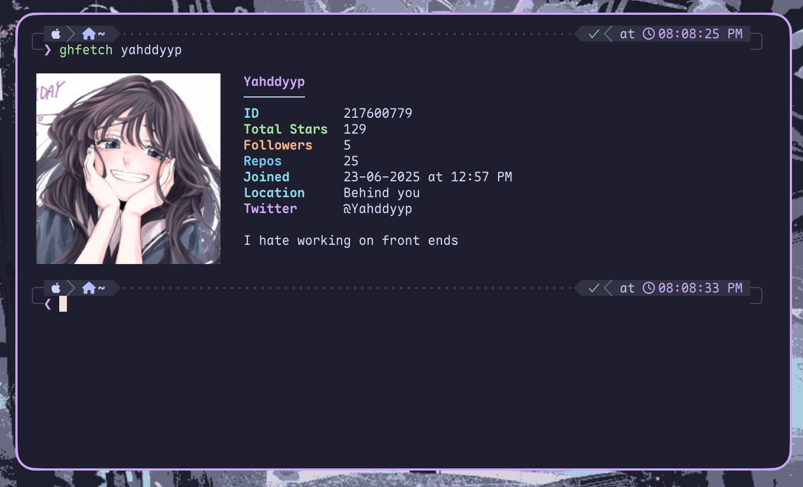

# Ghfetch

Ghfetch is a neofetch/fastfetch like tool for fetching github stats from different profiles and displaying it in a beautiful way.



## Installation

### Requirements

- A terminal that supports kitty's image rendering protocol (eg: ghostty or kitty).

> [!NOTE]
> Different terminal may use different variations of the kitty image protcol like ghostty using unicode placeholder and so the placement may be one to two lines off.

#### Homebrew

```bash
brew tap Yahddyyp/tap
brew install ghfetch
```

#### From source

```bash
git clone https://github.com/Yahddyyp/gh-fetch.git
cd gh-fetch
cargo build --release
```

The binary will be available at:

```
target/release/ghfetch
```

## Usage

```bash
ghfetch <username>
```

For example:

```bash
ghfetch yahddyyp
```

### Github Token

`ghfetch` works without authentication, but GitHub's API has stricter
rate limits for unauthenticated requests.

You can provide a GitHub **Personal Access Token** through:

```
export GHFETCH_TOKEN="your_token"
```

You do not need to give the personal access token any sorta permissions.
`ghfetch` will use the token for authenticated GitHub API requests.

### Configuration

The configuration file is located at:

```
~/.config/ghfetch/config.toml
```

You can customize which fields are displayed in what order:

```
fields = [
    "user",
    { underline = "user" }, # can take any sort of field or integer value
    "id",
    "total_stars",
    "followers",
    "repos",
    "joined",
    "company",
    "location",
    "twitter",
    "blog",
    "break",
    "bio",
]
```

Colors can be by customized:

```
name = { r = 203, g = 166, b = 247 }
# Uses the terminal's default foreground color if omitted
# underline = { r = 255, g = 255, b = 255 }
id = { r = 137, g = 220, b = 235 }
total_stars = { r = 166, g = 227, b = 161 }
followers = { r = 250, g = 179, b = 135 }
repos = { r = 116, g = 199, b = 236 }
joined = { r = 137, g = 220, b = 235 }
company = { r = 250, g = 179, b = 135 }
location = { r = 137, g = 220, b = 235 }
twitter = { r = 203, g = 166, b = 247 }
blog = { r = 203, g = 166, b = 247 }
```

And customise how the image appears:

```
[image]
image_columns = 24
image_rows = 12
left_gap = 1
right_gap = 3
```

<p align="center"><a href="https://github.com/yahddyyp/gh-fetch/blob/main/LICENSE"></a></p>
